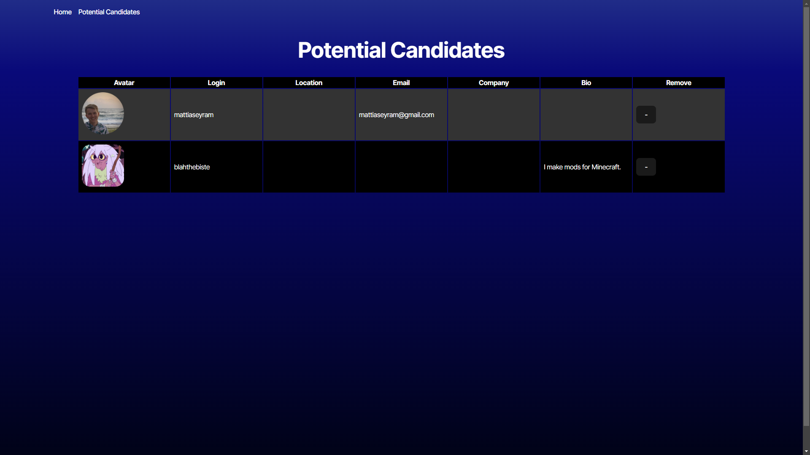
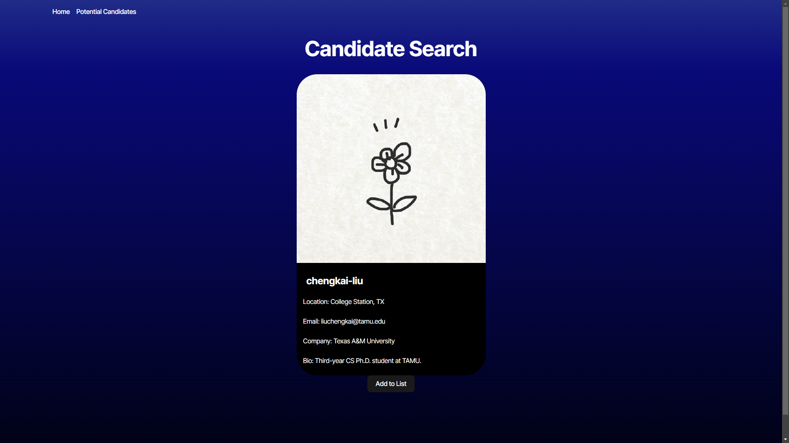

# Module 9 Challenge - Weather Widget

## Description

## Table of Contents

- [Installation](#installation)
- [Usage](#usage)
- [Contributions](#contributions)
- [License](#license)

## Installation

Visit [https://githubby.onrender.com](https://githubby.onrender.com)

## Usage

Hunting for employees via random github users.

## Contributions

Vite
Express.js
Render
Typescript

## License 

Licensed under None

## Tests

N/A

## Questions

Created by [dauntss](http://github.com/dauntss), [kat.krahulec@gmail.com](mailto:kat.krahulec@gmail.com)
